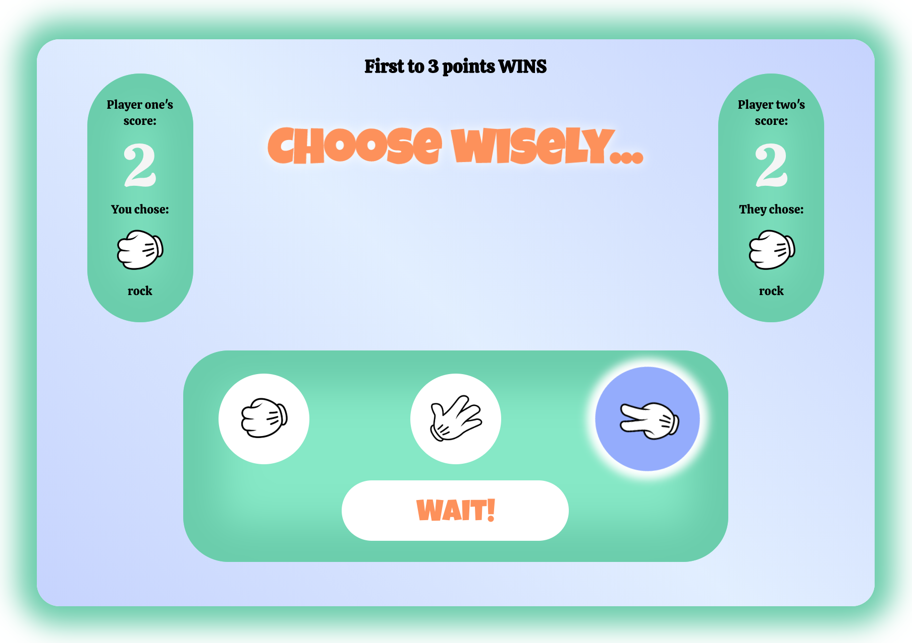

# 🗿📄✂️ Two-player rock-paper-scissors game! ✂️📄🗿

## [-- Click here for the client repository --](https://github.com/ahaigh9877/week-7-game-client)

## Contents

- **[Introduction](#introduction)**
- **[Getting started](#getting-started)**
- **[Technologies used](#technologies-used)**

## Introduction

For this project pairs of students were asked to produce a full-stack multiplayer game app using a React-Redux front-end with secure signup and login functionality and a back-end with a database for user information and streaming technology to keep both players in sync.

We decided to build a rock-paper-scissors game that can be played by two players on separate computers. Each player selects rock, paper or scissors, then clicks another button to confirm their choice. If the second player has yet to make their choice, the first player is told to wait. When both choices are made, players are told of the outcome and points are awarded. Streaming keeps both players up to date without the need for requests from the client.

## Getting started

1. Clone the git repository into a new directory on your computer: `git clone git@github.com:ahaigh9877/week-7-game-server.git`
2. Run `npm install` on your terminal to install all the dependendencies
3. Run `nodemon` to start the server
4. Follow the instructions to set up the [client](https://github.com/ahaigh9877/week-7-game-client)

## Technologies used

(click the links to see example code)

### Front-end

- [React](https://github.com/ahaigh9877/week-7-game-client/blob/master/components/Game/Game.js)
- [Redux-Thunk](https://github.com/ahaigh9877/week-7-game-client/blob/master/actions/users.js)
- [Superagent](https://github.com/ahaigh9877/week-7-game-client/blob/master/components/Room.js)

This project was bootstrapped using the [create-react-app](https://github.com/facebook/create-react-app) toolchain.

### Back-end

- [Express](./room/router.js)
- [Sequelize](./users/model.js)
- [json-sse](./master/index.js) to facilitate streaming.
